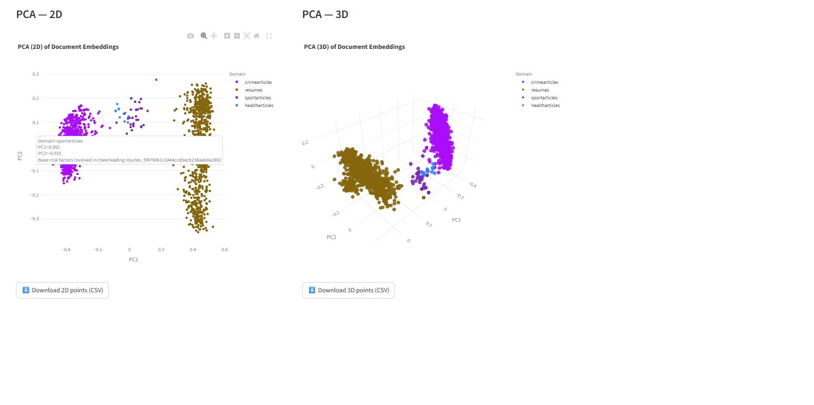

# ML 24/25-09 Semantic Similarity Analysis of Textual Data - Azure Cloud Implementation

## Contents

- [Introduction](#intro)
- [Project Overview](#projview)
- [Inputs and Outputs](#inputoutput)
- [Getting Started with Semantic Similarity Analysis](#prerequisites)
- [Experimental Flow of SE project](#seproj)
- [Experiment Execution on Azure](#azureproj)
- [How to run the experiment](#run)
- [Unit Test](#unitest)
- [Observation](#obsrvtn)
- [Conclusion](#concln)

<a name="intro"></a>

## Introduction

This project analyzes semantic similarity for both documents and phrases using OpenAI embeddings, KNN classification, and an Azure-based pipeline. The system preprocesses text aims at (tokenization, lemmatization, stopword removal in SE Project but focused on chunking and classification in cloud), generates embeddings, classifies documents across multiple domains, and computes cross-document similarity. Results are written to Azure Blob Storage and Azure Table Storage. The app is built in C# (.NET 8), fully Dockerized, and runs cloud-natively on Azure using Azure Container Registry (ACR), Azure Container Instances (ACI), and Azure Queue triggers for asynchronous processing.

[SE Project Documentation PDF link](https://github.com/senthilmasters2024/Tech_Tweakers/blob/main/SemanticAnalysisTextualData/SemanticAnalysisTextualData/Documentation/SemanticSimilarityAnalysisTextualData.pdf)

<a name="projview"></a>

## Project Overview

This section provides a high-level overview of the system, covering both the experimental workflow and the cloud deployment architecture.

### Project architecture

The system is designed as a fully cloud-native solution leveraging Microsoft Azure services:

<p align="center">
  
</p>
<p align="center">
  <em>Figure 1. Project Architecture.</em>
</p>

- **Docker** — Packages the application with all dependencies for consistent deployment.  
- **Azure Container Registry (ACR)** — Stores and manages the Docker images for deployment.  
- **Azure Container Instances (ACI)** — Runs the experiment workloads in a managed, isolated container environment.  
- **Azure Blob Storage** — Holds training datasets, documents to classify, requirement documents, classified outputs, and generated embeddings.  
- **Azure Queue Storage** — Triggers experiment execution through event-driven messages containing metadata and file locations.  
- **Azure Table Storage** — Stores structured outputs such as classification results, document similarity scores, phrase similarity results, and experiment metadata.  
- **Azure Resource Groups** — Logical grouping to manage and control access to related cloud resources.  


### Data Flow Architecture

The experiment execution begins when a queue message containing metadata triggers the process.

<p align="center">
  
</p>
<p align="center">
  <em>Figure 2. Data Flow Architecture.</em>
</p>

Once triggered, the experiment follows these main stages:

- **Queue Trigger** — A queue message containing experiment metadata and input file locations wakes up the experiment runner.
- **Training** — `trainingdocuments` container is processed; text is extracted from labeled PDFs and converted into embeddings for KNN model training.
- **Classification** — `documentstoclassify` container is processed; embeddings are generated and compared to the training set to assign predicted labels.
- **Store Classified Files** — Input files are saved into `classifieddocuments` container, organized by predicted label.
- **Requirement Comparison** — Embeddings from classified files are compared to those in the `requirementdocuments` container; similarity scores are stored in Azure Table named as `DocumentSimilarityResults`.
- **Phrase Similarity** — If CSVs are present in `phrasecomparsioncontainer`, phrase-level similarity is calculated and stored in `PhraseSimilarityResults`.
- **Results Storage** — All outputs, including embeddings (optional) and classification results, are written to **Azure Blob Storage** and **Azure Table Storage**.

<a name="inputoutput"></a>

## Inputs and Outputs


### Input:

The Semantic Similarity Analysis system accepts words and phrases, and also full-length documents as inputs. These are stored in Azure Blob Storage according to their role in the experiment, processed to plain text or read directly, and then embedded using OpenAI’s API inside an Azure Container Instance.

- **trainingdocuments** — Labeled PDFs per domain (*Resume, Health, Sport, Crime*) for KNN training (50–100 per domain).
- **documentstoclassify** — Unlabeled PDFs for classification into one of the supported domains.
- **requirementdocuments** — One reference PDF per domain for document similarity comparison.
- **phrasescomparison**  — CSV files containing phrase pairs for phrase-level similarity analysis.


### Output: 

The system produces the following outputs:

- **classifieddocuments** — PDFs sorted into per-domain subfolders in Blob Storage. *Example:* `classifieddocuments/resume`, `classifieddocuments/healtharticles`,`classifieddocuments/sportsarticles` and `classifieddocuments/crimesarticles`

- **classificationresults (Table)** — Records in Azure Table Storage containing predicted labels and document metadata.
- **documentsimilarityresults (Table)** — Cosine similarity scores between each classified document and its corresponding requirement document.
- **Phrase Similarity Results (Table)** *(Optional)* — Similarity scores for each phrase pair from the Phrases container.
- **Embeddings** *(Optional)* — Cached vector embeddings for re-use in future processing.

<a name="prerequisites"></a>

## Getting Started with Semantic Similarity Analysis

Follow the instructions below to set up and run the project.

### **Prerequisites**

Make sure you have the following installed and configured before proceeding:

- [**Docker Desktop**](https://www.docker.com/products/docker-desktop)
- [**Azure CLI**](https://learn.microsoft.com/cli/azure/install-azure-cli)
- **Microsoft Azure Account** ([Create one](https://portal.azure.com))
- **OpenAI API Key** ([Get one](https://platform.openai.com/))
- [**.NET SDK 9.0 or later**](https://dotnet.microsoft.com/en-us/download/dotnet)

### **Before You Start**

Before running the experiment for the first time, you must create your **own Azure Storage account** and configure it with the required containers, queues, and tables.  


Required resources:
- **Blob Containers**  
  - `trainingdocuments` – training datasets, organized into domain subfolders (`resumes/`, `sportsarticles/`, `healtharticles/`, `crimearticles/`)  
  - `documentstoclassify` – documents to be processed/classified  
  - `requirementdocuments` – reference documents for similarity checks, organized into the same domain subfolders  
  - `phrasecomparisoncontainer` *(optional)* – CSV files for phrase-level similarity analysis  
  - `classifiedoutput` – stores classified results (output)
- **Queue**  
  - `trigger-queue` – used to initiate experiments
- **Tables**  
  - `ClassificationResults`, `DocumentSimilarityResults`, `PhraseSimilarityResults` *(optional)* – stores processing results

---

### **Setup Instructions**

#### 1. Clone the Repository

```bash

git clone https://github.com/UniversityOfAppliedSciencesFrankfurt/se-cloud-2024-2025.git
git checkout TechTweakers

```

#### 2. Navigate to the project Directory

```bash

cd se-cloud-2024-2025/Source/TechTweakers/

```
#### 3.Install Required NuGet Packages

```bash

dotnet restore

```
#### 4. Build and Push Docker Image for Cloud Deployment

```bash

docker build -t mycloudproject:dev .
docker tag mycloudproject:dev techtweekers.azurecr.io/mycloudproject:dev
docker push firstcontainerregistrysample.azurecr.io/mycloudproject:dev


```

#### 5.. Run the Application

```bash

dotnet run --language eng --openAIKey "YOUR_OPENAI_API_KEY" --inputPath "path/to/input/folder or file"

```

<a name="seproj"></a>

## Experimental Flow of SE Project

The Semantic Similarity Analysis algorithm classifies documents into predefined domains and measures their similarity to reference documents or phrases. It processes text inputs, generates vector embeddings using OpenAI models, applies a k-NN classifier for category prediction, and calculates cosine similarity scores for both documents and phrases.A brief step by step description of the SE project is as follows:

### 1. Input Processing

Downloads training documents , requirement,documentto classify and phrase documents from Azure Blob containers to bin folder path for local processing .

### 2. Embedding Generation
To handle long inputs, we split text into ~3000-character chunks and embed each with OpenAI text-embedding-3-large, then average the vectors into a single representation: OpenAIEmbeddingService.GetEmbeddingAsync powers training/classification, whereas SemanticSimilarityForDocumentsWithInputDataDynamic.GetAveragedEmbeddingAsync is used for document similarity. This is done by using the following :

```csharp

// MyExperiment/Services/OpenAIEmbeddingService.cs
public async Task<float[]> GetEmbeddingAsync(string text)

```

### 3. Classification with KNN
PDFs are classified using K-Nearest Neighbors based on embedding similarity. Classified PDFs are grouped and saved into folders.The below code is the core logic of this classification. 

```csharp

// Create the classifier with training data and k=3
var knn = new KNNClassifier(trainingData, k: 3);
// Initialize the PDF reader to extract text from training and test documents
var pdfReader = new PdfReaderService();
// Initialize the OpenAI embedding service with the chosen model and API key
var embeddingService = new OpenAIEmbeddingService("text-embedding-3-large", openAIKey);

// Load and embed training data (from training folder downloaded as blob) and return it as a list of labeled vectors
var trainingData = await LoadTrainingDataAsync(pdfReader, embeddingService, inputData,request);

// Train the K-Nearest Neighbors classifier using the embedded training data
var knn = new KNNClassifier(trainingData, k: 3);

// Classify the test files using the trained KNN classifier
await ClassifyTestFilesAsync(pdfReader, embeddingService, knn);

```

### 4. Document Comparison
Requirement docs vs classified docs are compared within shared domains.Similarity is calculated (Cosine Similarity), and results are logged.

### 5. Phrase Similarity
Phrases from input CSV are embedded and compared.Results are saved as CSV and pushed to Azure Tables.

### 6. Result Upload
All experiment outputs are saved to Azure Storage. The document embeddings in the documentembeddings container, classified outputs in the classifiedoutput container, and associated metadata/scores in Azure Tables.

<a name="azureproj"></a>

## Experiment Execution on Azure

### 1. Create an Azure Container registry (ACR)


### 2. Add Docker support and build image locally

```bash

docker build -t mycloudproject 

```


### 3. Login to Azure, Manage ACR, and Run the Container

```bash

# log in to Azure and to ACR
az login
az acr login -n <account-name>

# find the local image
docker images

# tag & push
docker tag mycloudproject:latest $ACR.azurecr.io/mycloudproject:v1
docker push $ACR.azurecr.io/mycloudproject:v1

# Pull image from ACR
docker pull <account-name>.azurecr.io/mycloudproject:v1

# Run with default configuration
docker run -it <account-name>.azurecr.io/mycloudproject:v1

# Or run with custom appsettings.json
docker run -it -v $(pwd)/appsettings.json:/app/appsettings.json <account-name>.azurecr.io/mycloudproject:v1

```

### 4. Create an Azure storage account and the required blob containers

The following containers needs to be created:

- **trainingdocuments** – Stores the training dataset for each domain.
- **documentstoclassify** – Contains the documents to be classified.
- **requirementdocuments** – Holds one reference document per domain for comparison.
- **phrasecomparisoncontainer** – Contains CSV files for phrase-level similarity tasks.
- **classifiedocuments** *(outputs)* – Stores the classified documents.
- **documentembeddings** *(outputs)* – Stores computed embeddings for documents.

### 5.Configuration (appsettings.json) 
Before running the experiment, create an `appsettings.json` file in the project root.  This file contains Azure Storage connection settings, container names, table names, and category folders used for training and requirement matching.
```json
{
  "Logging": {
    "IncludeScopes": false,
    "LogLevel": {
      "Default": "Debug",
      "System": "Information",
      "Microsoft": "Information"
    }
  },
  "MyConfig": {
    "StorageConnectionString": "DefaultEndpointsProtocol=https;AccountName=YOUR_STORAGE_ACCOUNT;AccountKey=YOUR_KEY;EndpointSuffix=core.windows.net",
    "TrainingContainer": "trainingdocuments",
    "DocumentToClassifyContainer": "documentstoclassify",
    "RequirementContainer": "requirementdocuments",
    "ClassifiedDocuments": "classifieddocuments",
    "ClassificationResultsTable": "ClassificationResults",
    "PhraseComparisonContainer": "phrasecomparsioncontainer",
    "DocumentEmbeddings": "documentembeddings",
    "Queue": "trigger-queue",
    "RequirementCategoryFolders": [
      "developerprofiles",
      "devopsprofiles",
      "healthcareprofiles",
      "healtharticles",
      "sportarticles",
      "resumes",
      "crimearticles"
    ],
    "TrainingCategoryFolders": [
      "developerprofiles",
      "devopsprofiles",
      "healthcareprofiles",
      "healtharticles",
      "sportarticles",
      "resumes",
      "crimearticles"
    ]
  }
}

```

### 6. Upload Input Files to Azure Blob Storage(Containers)

The following C# code is used to upload inputs :

```csharp

using Azure.Storage.Blobs;
using System;
using System.IO;

// Connection string to your Azure Storage Account
string connectionString = _config.StorageConnectionString; // or Environment.GetEnvironmentVariable("AZURE_STORAGE_CONNECTION_STRING")

// Container where training input files are stored
string containerName = "trainingdocuments"; // same as MyConfig.TrainingContainer

// Category folder in the container (MUST match appsettings MyConfig.TrainingCategoryFolders)
string category = "developerprofiles"; // e.g., "developerprofiles", "devopsprofiles", "healthcareprofiles"

// Path to the local file to upload
string filePath = @"C:\data\training\resume1.pdf"; // change to your file

// Create a BlobServiceClient
BlobServiceClient blobServiceClient = new BlobServiceClient(connectionString);

// Get a reference to the container and create it if it doesn't exist
BlobContainerClient containerClient = blobServiceClient.GetBlobContainerClient(containerName);
await containerClient.CreateIfNotExistsAsync();

// Get a reference to the blob (CATEGORY PREFIX + file name)
string fileName = Path.GetFileName(filePath);
string blobName = $"{category}/{fileName}";
BlobClient blobClient = containerClient.GetBlobClient(blobName);

// Upload the file
await blobClient.UploadAsync(filePath, overwrite: true);

Console.WriteLine($"File '{fileName}' uploaded to '{containerName}/{blobName}'.");


```

### 7. Send Queue Message (trigger-queue).

The trigger-queue (from appsettings.json) signals the container to start processing. 

Example Queue message (JSON):

```json

{
  "ExperimentId": "exp-2025-08-14",
  "Name": "Semantic Similarity Test 2",
  "Description": "Second Experiment with Queue",
  "MessageId": "msg124",
  "MessageReceipt": "abc457",
  "TrainingInputFilesUrl": "https://techtweekersstorage.blob.core.windows.net/trainingdocuments",
  "DocumentsToClassifyUrl": "https://techtweekersstorage.blob.core.windows.net/documentstoclassify",
  "RequirementDocumentsUrl": "https://techtweekersstorage.blob.core.windows.net/requirementdocuments",
  "PhraseComparisonFilesUrl": "https://techtweekersstorage.blob.core.windows.net/phrasecomparsioncontainer",
  "OpenApiKey": "YOUR-API-KEY"
}

```


### 8. Message Reception (ReceiveExperimentRequestAsync)

The input file is downloaded locally for processing.When a message arrives in the queue, it is received and deserialized. 
The following code from IStorageProvider in MyCloudProject.Common performs this:

```csharp

public async Task<IExerimentRequest> ReceiveExperimentRequestAsync(CancellationToken token)
{
    // 1. Create a QueueClient to connect to the Azure Storage Queue
    //    using the connection string and queue name from configuration.
    _queueClient = new QueueClient(_config.StorageConnectionString, _config.Queue);

    // 2. Ensure the queue exists (creates it if not).
    await _queueClient.CreateIfNotExistsAsync();

    // 3. Receive available messages from the queue.
    QueueMessage[] messages = await _queueClient.ReceiveMessagesAsync();

    // 4. If there are messages, process the first one.
    if (messages.Length > 0)
    {
        // 4.1 Convert the message body to string.
        string msgTxt = messages[0].Body.ToString();

        // 4.2 Deserialize the message into an experiment request object.
        var request = JsonSerializer.Deserialize<ExerimentRequestMessage>(msgTxt);

        // 4.3 Store the message ID and receipt (needed for deletion later).
        request.MessageId = messages[0].MessageId;
        request.MessageReceipt = messages[0].PopReceipt;

        // 4.4 Return the populated request.
        return request;
    }

    // 5. If no messages are available, return null.
    return null;
}

```

### 9. Input Download (DownloadInputAsync)

Once the request is received, the referenced input files are downloaded from Azure Blob Storage to a local working directory for processing. This ensures all processing happens locally inside the container before output is generated.The below method downloads the input file from Azure Blob Storage.

```csharp

public async Task<string> DownloadInputAsync(string fileName, IExperimentRequest request)
{
    // 1. Initialize the BlobContainerClient for the training container
    //    using the connection string from configuration.
    BlobContainerClient container = new BlobContainerClient(
        _config.StorageConnectionString, 
        _config.TrainingContainer
    );

    // 2. Define a local folder path to store downloaded files.
    string localPath = Path.Combine(Directory.GetCurrentDirectory(), "DownloadedFiles");

    // 3. Create the folder if it does not already exist.
    Directory.CreateDirectory(localPath);

    // 4. Get a BlobClient reference for the specific file (use only the file name).
    BlobClient blob = container.GetBlobClient(Path.GetFileName(fileName));

    // 5. Define the full local path where the file will be saved.
    string downloadPath = Path.Combine(localPath, Path.GetFileName(fileName));

    // 6. Download the file from Azure Blob Storage to the local path.
    await blob.DownloadToAsync(downloadPath);

    // 7. Return the local file path for further processing.
    return downloadPath;
}

```


### 10. Experiment Execution 
Once all inputs are ready, the main experiment logic is invoked from Program.cs:

```csharp

IExperimentResult result = await experiment.RunAsync(localFileWithInputArgs);

```
### 11. Upload Output (UploadResultAsync)
After processing, results are uploaded back to Azure Blob Storage in the classifiedoutput container. This ensures processed outputs are accessible for further analysis.

```csharp

public async Task UploadResultAsync(string experimentName, IExperimentResult result, DateTime starttime, IExperimentRequest request)
{
    // 1. Create a Blob container client for storing results.
    BlobContainerClient container = new BlobContainerClient(
        _config.StorageConnectionString, 
        _config.ClassifiedDocuments
    );

    // 2. Create the container if it does not exist.
    await container.CreateIfNotExistsAsync();

    // 3. Upload the output file using the experiment name.
    using FileStream fileStream = File.OpenRead(result.OutputFile);
    await container.UploadBlobAsync($"{experimentName}.csv", fileStream);
}

```

### 12. Store Results in Table Storage

In addition to output files, metadata and similarity scores are saved to Azure Table Storage (ClassificationResults table). This allows quick lookups, historical tracking, and dashboard integrations.

### 13. Commit Queue Message (CommitRequestAsync)

The processed queue message is deleted to prevent reprocessing. 
The below code snippet is used:

```csharp

  //  Delete the message using its ID and receipt to confirm completion.\

    await queueClient.DeleteMessageAsync(
        request.MessageId, 
        request.MessageReceipt
    );


```

### 14. Final Results

After the experiment execution is complete, results are stored as follows:

- **Blob Storage** – Contains:
  - Classified output documents in the `classifieddocuments` container.
  - Generated embeddings stored under the designated embeddings container named `documentembeddings`.
- **Table Storage** – Holds experiment metadata and execution logs.
- **Azure Queue** – Messages are automatically deleted after successful processing to prevent reprocessing.

**Note (Local Execution):**  
If the experiment is run locally instead of in Azure, the output files and generated artifacts will be placed in the project’s build output directory:

`C:\CloudExcercises\se-cloud-2024-2025\Source\MyCloudProjectSample\MyCloudProject\bin\Debug\net9.0`

This folder contains:
- The compiled application binaries.
- Any configuration or resource files copied during the build.
- Locally generated results (classified documents, embeddings) if the application is configured to write outputs to the local file system.

<a name="run"></a>

## How to Run the Experiment

1. **Upload input files** to their respective Azure Blob containers  
   See the full list of required containers and folder structures in [Before You Start](#before-you-start).  
   Ensure your Azure Storage account is set up with these containers before proceeding.


2. **Start the worker** in your preferred environment:

   * Azure Container Instance (ACI)
   * Local Docker container
   * Visual Studio run configuration  

3. **Submit a trigger message** to the Azure Storage Queue 
(`trigger-queue`) with required metadata (see *Sample Queue Message* in [Experiment Execution on Azure – Send Queue Message](#7-send-queue-message-trigger-queue))


4. **Monitor experiment progress** via container logs (ACI/Docker/Visual Studio).

5. **Review outputs** after completion:
   * **Blob Storage**:
     * `classifiedoutput` – classified files
     * `documentembeddings` – (optional) embeddings CSV
   * **Azure Table Storage**:
     * `ClassificationResults` – predicted labels + neighbors
     * `DocumentSimilarityResults` – document vs requirement scores
     * `PhraseSimilarityResults` – phrase-pair similarity scores
 * **Semantic PCA Plots Streamlit Based Python UI**:
     * Four Types of charts are generated using a streamlit based python app which utlizes this blob storage and generated table results for better analysing the similarity scores and classification, here  different types of charts are generated like bar chart to represent distribution of documents in different categories, PCA components of the generated embeddings are utilized to visualise the 2D and 3D based to visualise how embeddings of each documents are grouped together in a high dimensional vector spaces.
     * By selecting the individual files that are uploaded for the documents to be classified can be selected in the dropdown to provide validation option to the user by identifying if the top neigbours files are closely relatedd to the predicted labels and the category.
     * Embedding Component Chart - Help to generate the embedding component in X-axis vs cosine similarity score in Y-axis between any two selected documents to visaulise the similarity of embeddings in high dimensional vector space also help to confirm that embeddings are generated in the output of the document embeddings folder.

    

*  * **Document Similarity Streamlit Based Python UI**:
     * Helps to generate scatter plots having representation of rank in the x-axis vs similiarty score in the y-axis, helps to represent the top and lowest similarity scores among 1000´s of documents that are used in the process, each predicated categories like top similarity score, low similarity and avarge score between the top and lowest are represented in different colors.
     * The Document Similarity Explorer provides an interactive way to analyze similarity scores between documents stored in Azure Table Storage. Users can connect using a SAS URL and select specific domains (e.g., crimearticles, resumes, healtharticles, sportarticles) to visualize results. The left panel includes controls to adjust the number of top and least similar documents displayed, set a similarity threshold, filter by filenames, and refresh or clear cached results. The main chart on the right plots documents ranked by similarity score, with the y-axis representing similarity values and a horizontal dotted line showing the chosen threshold. Points are color-coded to highlight the most similar documents (green), the least similar documents (red), and others (grey). This setup allows users to quickly identify strong and weak similarity relationships within each domain and validate how well the classification model distinguishes between documents.

 <p align="center">
  
  <em>Figure 4. Document Similartiy Scatter Plots</em>
     
### Unit Test

Validates the complete pipeline, including: loading input documents, generating embeddings, performing document and phrase similarity analysis, saving outputs locally `bin\Debug\net8.0`, uploading results to Azure Blob Storage, and logging metadata to Azure Table Storage.

<p align="center">
  

<a name="obsrvtn"></a>

### Observation

The label distribution across domains remains roughly balanced, with only a minor skew. PCA-based 2D and 3D projections reveal compact, well-separated clusters by domain, with a few boundary points drifting toward other groups. After preprocessing including document chunking, the KNN classification using OpenAI embeddings shows strong same-domain matching in Top-K neighbor views, with high cosine similarity scores.

The per-dimension embedding component traces for paired documents follow similar shapes, confirming that the semantic signal is well preserved and not overwhelmed by noise. Ranked similarity charts display a clear gap between the highest and lowest scores, providing a natural threshold to accept matches or flag them for review. Operationally, the pipeline behaves as expected, the  inputs appear in the correct source containers, chunked embeddings and processed documents are stored in documentembeddings/ and classifieddocuments/, and run metadata plus similarity scores are correctly written to Azure Tables.

  <a name="concln"></a>

Generated different types of results helps to analyse and observe whats actually happening and how flexible this tool can be utilized for different usecases,


**Example Observation 1:**
The chart shows the distribution of predicted labels across different domains.
Crime Articles and Resumes are the most frequent categories, with counts close to their actual dataset proportions.Sports Articles and Health Articles are fewer in number, and the model has correctly reflected this distribution.
The alignment between predicted and actual category proportions indicates that the model is classifying documents properly according to their respective domains.

The below chart shows the distribution of predicted labels across different domains, where Crime Articles and Resumes appear as the most frequent categories with counts closely matching their actual dataset proportions. In contrast, Sports Articles and Health Articles occur less frequently, and the model has correctly reflected this lower representation. Overall, the alignment between predicted and actual category proportions demonstrates that the model is classifying documents accurately according to their respective domains.

The PCA visualizations in both 2D and 3D demonstrate how the document embeddings cluster according to their semantic domains. The results show that Crime Articles and Resumes form distinct and well-separated groups, highlighting strong domain-specific patterns in the embeddings. Similarly, although smaller in number, Sports Articles and Health Articles also cluster closely within their respective categories, reflecting accurate separation despite limited samples. Overall, the tight grouping within domains and clear separation between different domains indicate that the embedding model effectively captures semantic relationships and supports reliable document classification.

<p align="center">
  
 <em>Figure 6. PCA Plots To Represent Clusters</em>

The Embedding Components (scalar values) view shows a component-wise comparison of two documents, lululemon murder and murder of umesh kolhe, both belonging to the crimearticles domain. Each document is represented as a high-dimensional embedding vector, and the plot aligns their values across all 3,072 dimensions. The blue line corresponds to the first document, while the red line corresponds to the second.
The overall similarity between the two embeddings is calculated using cosine similarity, which in this case is 0.4426. This moderate score reflects that while both documents share a common crime-related theme, they are not identical in semantic content. The overlapping patterns of the two series across most dimensions confirm shared features, while variations in certain regions highlight domain-specific differences.
 
 <p align="center">
  
  <em>Figure 7. Visualising Embedding Component between Any Two Documents</em>

The below chart in Figure 8 shows the similarity distribution for documents in the resumes domain, where each point represents a pairwise similarity score between documents sorted in ascending order. The y-axis indicates similarity values, with the dotted horizontal line marking the threshold at 0.50. Documents with the highest similarity scores are highlighted in green, such as the pair HR_Generalist_Requirements.pdf and another resume with a similarity score of 0.6118, indicating strong alignment. In contrast, documents with the lowest similarity scores are shown in red, reflecting weaker semantic relationships, while the remaining cases fall in between as grey points. Overall, the chart demonstrates that the model effectively distinguishes resumes with close semantic relevance from those that are only loosely related.

 <p align="center">
  
  <em>Figure 8. Document Similartiy Score Documents Based on Rank in X-axis vs Similarity Score in Y axis</em>

The below chart in Figure 9 shows the similarity distribution for documents in the crimearticles domain, with similarity scores plotted on the y-axis and ranked in ascending order on the x-axis. Documents with the lowest similarity values are highlighted in red, such as the pair Crime_Requirement_20250814-0234.pdf and Luis_Iberico_(politician).pdf, which achieved a similarity score of 0.1146, indicating minimal semantic overlap. At the other end, the highest similarity scores are highlighted in green, reflecting pairs of documents that are strongly related in content. The grey points represent intermediate cases. Overall, the chart demonstrates that while some crime-related documents share very little in common, others are closely aligned, and the model effectively captures these variations in semantic similarity within the domain

<p align="center">
  
  <em>Figure 9. Document Similartiy Score Documents Based on Rank in X-axis vs Similarity Score in Y axis</em>
 
### Conclusion 

The end-to-end workflow (Blob → embeddings → KNN → similarity → Tables/Blobs) is working as intended. OpenAI embeddings are sufficiently discriminative for these domains, making KNN a solid baseline. A practical acceptance threshold can be taken from the “elbow” in the ranked-similarity curve, with items below that threshold queued for manual review. To improve robustness, balance under-represented classes, add hard negatives (near-miss cross-domain documents), and monitor PDF text-extraction quality. Operationally, keep caching embeddings to avoid recomputation, watch Azure Table outputs for drift, and version each run via ExperimentMetadata to ensure reproducibility.


